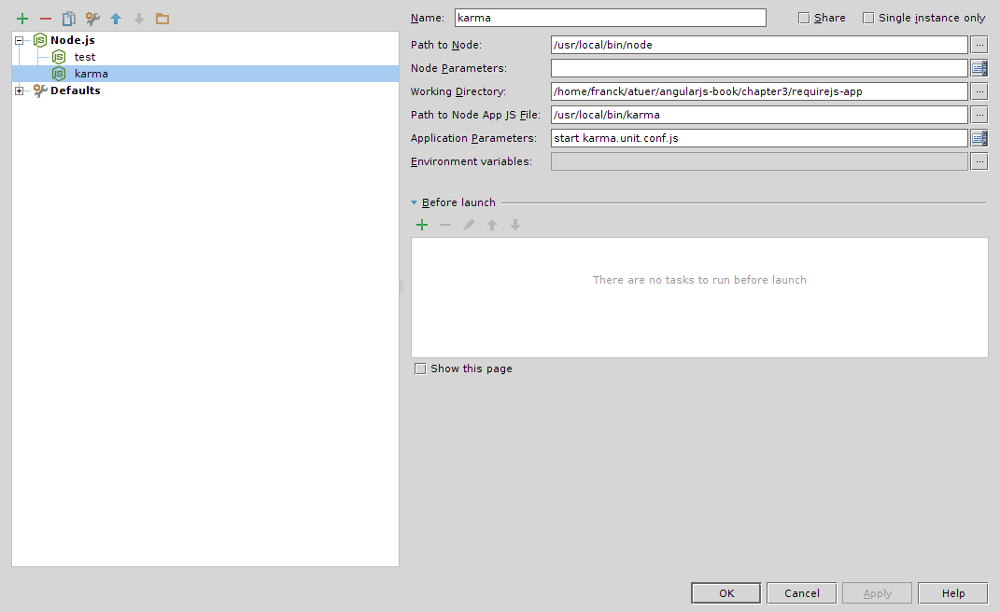

### This is an example from the Angular.js book using Angular with require.js.###

The karma test runner is of particular interest, it is used to run regular unit testing and also end-to-end (a.k.a.
functional) testings.

To install karma (node.js module) globally use the cmd:

`npm install karma -g`

Configuring Karma inside Webstorm is interesting to have an immediate feedback (with clickable stack trace) on failing tests.

Grunt:

Grunt (require node.js) has also been configured for the build.

`grunt dev` will run a development http server listening on port 9001.

`grunt build` will run both karma unit and e2e testing with the PhantomJS browser (PhantomJS is also a requirement).

It is also possible to configure [karma inside the build for development](https://github.com/karma-runner/grunt-karma#karma-server-with-grunt-watchregarde "Karma Server with Grunt Watch") in association with the grunt watch task but I think it is better
to integrate it directly with Webstorm to take advantage of the integrated console/stack trace.

To setup grunt and already configured tasks (in package.json):

`npm install`

To setup a new grunt plugin:

`npm install grunt-plugin-name --save-dev` [to update package.json]

